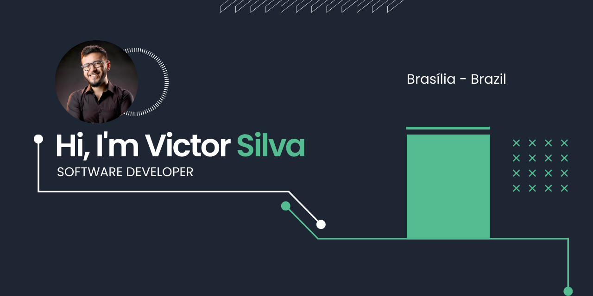

**Software Engineer | Full Stack & Blockchain Developer**

## About Me

I'm a Full Stack Engineer with extensive experience in web development. I have developed applications for major companies in Brazil, such as Caixa Econômica Federal, and worked on several projects in the US.

## Contact Details

- **Location:** Born in Toyohashi-Aichi, Japan | Lives in Brasília, Brazil
- **Mobile:** +5561991033751
- **LinkedIn:** [Victor Matheus Silva](https://www.linkedin.com/in/victor-matheus-da-silva-4a927238/?locale=en_US)
- **Instagram:** [@victoriwakawa](https://www.instagram.com/victoriwakawa/)

## Skills

- **Frontend:** ReactJs, React Native, HTML, CSS
- **Backend:** Node.js, Docker, Nginx
- **Blockchain:** Hyperledger Composer, Smart Contracts in Hyperledger Fabric, IBM Blockchain platform
- **Database:** SQL, Sequelize
- **Other:** Redux, Typescript, AWS Services (EC2, S3, Cloudfront, RDS, Route 53), Microservices REST API, VPC, DNS Management
- **Languages:** Portuguese (native), English (advanced), Spanish (intermediate), French (basic), Brazilian Sign Language (basic)

## Work Experience

### Software Engineer
**Praxent - TX, USA | 2021 - Present**

- Worked on a retirement monthly investment app, deploying it on Microsoft App Center.
- Integrated a trading app with APEX.
- Developed a Typescript project for an automotive parts alliance.
- Presented successful cases to the company and ran client demos.
- Worked with Reactjs, React Native, Typescript, and Nodejs solutions.

### Full Stack & Blockchain Developer
**Fanprojects S/A | 2018 - 2021**

- Developed a blockchain loyalty system and a REST Microservices Integration API on Nodejs.
- Created a Reactjs front-end web application and a blockchain service using Hyperledger Composer.
- Utilized AWS infrastructure for the SAAS application.

### Full Stack & React PWA Developer
**Otimicar | 2018**

- Developed an alternative app for QR code reading and interpretation for partners, implemented as a Progressive Web App.
- Utilized ReactJs, Docker, Redux, Manifest.json, Service Workers, and Push Notifications.

### Junior Web Developer
**Ministry of Planning | 2018**

- Developed a platform using AngularJs, HTML, and CSS to link public companies with nominated individuals for positions at state-owned enterprises.

## Education

- **Military School Dom Pedro II** - High School
- **University of Brasília** - Electrical Engineering (2016 - 2022, Not finished)

## Certifications

- **Google Adwords Nanodegree** - Udacity

## Languages

- **Portuguese:** Native
- **English:** Advanced (553 TOEFL ITP)
- **Spanish:** Intermediate
- **French:** Basics
- **Brazilian Sign Language:** Basics

## Medium Articles

- [Uma jornada React: do zero até o deploy automatizado. S3 + Gitlab CI + IAM](https://bit.ly/2RYJbYE)
- [PWA: Progressive Web Applications](https://bit.ly/2COeOva)

## Other Interests

- Social Causes
- Art: Guitar, bass, and other instruments
- Poetry and writing
- Photography

## Academic Experiences

- **Teacher at Colmeia's App**: Taught exact sciences, giving about 380 class hours in a year with a 5-star rating.
- **Calculus 1 and 2 Monitor**

## Social Exchange

- **Colombia**: Worked at a foundation for socially abandoned children, teaching English and participating in daily management and maintenance.

## Other Experiences

- **Director of Marketing at University’s Junior Company**: Deployed strategic goals, led a team, coordinated passive prospecting, and generated leads.
